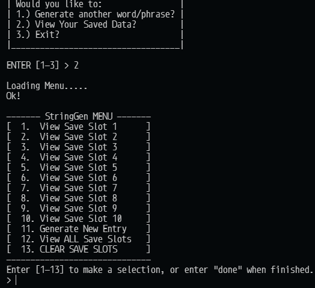

# StringGen

---

## Instructions

---

StringGen is very simple to use. Instructions will appear on screen for each step when running the program, and all user interaction is done through typing out the appropriate response, and pressing **ENTER** to confirm your command.

As of now StringGen is command-line only, but soon I plan on starting the implementation of a simple GUI front-end.

---

## Installation

---

1. Download zip archive containing source code.
2. Extract to desired installation location.
3. Open console/terminal inside "StringGen" folder, and enter `pip install -r requirements.txt` to install dependencies.
4. Run `python "path/to/directory/StringGen/src/StringGen.py"`
5. Done!

## About StringGen

---

Hello and welcome!

StringGen is a very small personal project of mine, designed to generate a specifically chosen number of random words that can be used/saved/reviewed for a variety of purposes! StringGen is actually my _FIRST_ ever personal-project uploaded on Github with some actual _long-term "development planning"_ in mind. By this, I mean rather than writing a simple practice program, making sure it works, and forgetting about it, I wanted to come up with a project that I could continue to improve upon over time, simultaneously serving as a sort of beginner's learning experience for me.

I decided to start this project primarily to help improve my Python skills, as well as general skills revolving around using GitHub _(which I still have difficulty with)_, and what it takes to design a usable program for others to use. StringGen may not be the most original or ambitious project out there, but for me, this is the perfect learning experience and a way to bolster my abilities.

Thank you so much for reading, and feel free to submit and bugs/feedback you may have!

---

### StringGen CLI Screenshot

